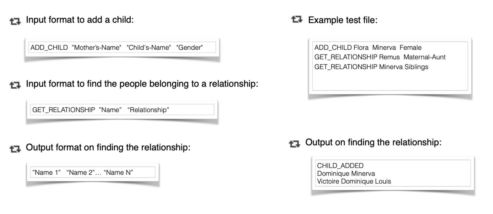

# SOFTWARE ENGINEER TAKE HOME TEST - BACKEND

Congratulations, we would like to invite you to complete our Backend Software Engineer coding challenge! 

This should take 2-4 hours and we give candidates 3 days to complete it and send it back.

We would like to thank our friends at Geektrust for allowing us to use this challenge.

1. Getting the right output is important, but more important is clean code and how well designed your code is. We use Geektrust for our tests so you should absolutely take a look at their [help page](https://www.geektrust.in/blog/2018/01/24/get-started-geektrust-coding-challenge/) on what we look for in your code, and how to get started with the coding challenge. 

2. If you are writing the codei in Java, you have to use either maven or gradle with the respective build files. Please download them from the links below. Edit the build file to set your ‘{your.qualified.name.of.main.class}’ and add your dependencies if any. Ensure the generated executable is named ‘geektrust.jar’.
    * [pom.xml](https://raw.githubusercontent.com/geektrust/coding-problem-artefacts/master/build-files/java/pom.xml)
    * [build.gradle](https://raw.githubusercontent.com/geektrust/coding-problem-artefacts/master/build-files/java/build.gradle)

3. Please add a readme with how to get your code working and how to test your code too. 

4. We expect a command line app. So no web apps will be considered for evaluation. We don’t need data stores either. 

5. Usage of non essential 3rd party libraries will affect your evaluation.

6. We will download your solution which will be seen by some of Shippit’s Software Engineers so please ensure the solution works on any system without any code changes/manual setup.

Our problem is set on the planet of Lengaburu, the
distant galaxy of Tara B. Our protagonists are King
Arthur, Queen Margaret and their family.

  

King Arthur is the emperor of Lengaburu and has been
ruling the planet for the last 350 years (they have long lives in Lengaburu!). 

Let’s write some code to get to know the family.

The coding problem is for backend and fullstack
engineers and test object oriented fundamentals.

## MEET THE FAMILY

Write code to model out the King Arthur family tree so that:

* Given a ‘name’ and a ‘relationship’, you should output the people corresponding to the relationship
in the order in which they are added to the family tree
* You should be able to add a child to any family in the tree through the mother

Simple right? Remember, our evaluation is based not only on getting the right output, but on how you
have written your code.

## SAMPLE INPUT/OUTPUT
Input needs to be read from a text file. and output should be printed to console. **Your program
should take the location to the test file as a parameter**.

More sample output scenarios.

**You need to stick to the Sample input output format as shown**. This is very important as we
were automating the correctness of the solution to give you a faster evaluation. You can find some
sample input output files [here](https://github.com/geektrust/coding-problem-artefacts/tree/master/sample-io/Set1-Family-BD-IO-PS1).

## RELATIONSHIPS TO HANDLE

There are many relationships that could exist but at a minimum, your code needs to handle these
relationships.

## CHECKLIST - SUBMITTING CODE
1. Please open a Pull Request against this repository.
2. Replace this README with pertinent information.
3. Please include only source files and do not include any libraries or executables or
node_modules folder.